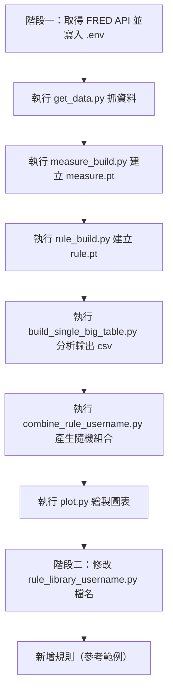

# 注意事項:
1. 經濟數字會更改過去數字 參考GDPC1 (FRED)
2. fred的資料來源會有兩個get_series_df 、 get_series_df ()
3. 找出單一個代號的資料
   ```
    import torch
    from function_library import load_tensor,load_pickle
    df = pd.DataFrame(load_tensor(os.path.join("measure", "GDPC1", "GDPC1.pt"),method = 'hdf5')[:,0,:])
    date_list = load_pickle(os.path.join("measure","GDPC1","GDPC1_date_list" + ".pkl"))
    df.index = date_list  # 設置 index
    df.columns = date_list  # 設置 columns
    df.to_csv("GDPC1.csv",encoding = 'utf-8-sig')
    ```

---

# 執行步驟

## 階段一
1. 取得FRED的API然後取代.env的API
2. 執行[get_data.py](/src/get_data.py) -> 目的 : 從FRED抓資料
3. 執行[measure_build.py](/src/measure_build.py)-> 目的 : 建立measure.pt
4. 執行[rule_build.py](/src/rule_build.py) -> 目的 : 建立rule.pt
5. 執行[build_single_big_table.py](/src/build_single_big_table.py) -> 目的 : 分析結果 產生 single_table_long.csv,single_table_short.csv
6. 執行[combine_rule_username.py](/src/combine_rule_username.py) -> 目的 : 分析結果 產生 隨機的組合 在combine_rule
7. 執行[plot.py](/src/plot.py) -> 目的 : 畫圖

## 階段二
1. 把rule_library_username.py的檔名名中的username改成你的名子
2. 參考rule_build.py新增rule

## 建立畫面
1. 用goole帳號建立一個google 用的api json(https://ithelp.ithome.com.tw/articles/10234325)
2. 把json檔案複製到EconomicAnalysis下 (檔名是myKey.json)
3. Google Excel 的權限要分享給API (看起來會像是分享電子郵件)
4. 在VS CODE 的終端機執行[Convert]::ToBase64String([System.Text.Encoding]::UTF8.GetBytes((Get-Content -Raw myKey.json)))
5. 會出現一堆看似亂碼的文字，把他貼到.env檔案中的GOOGLE_CREDENTIALS變數後面
6. 把google sheet 的網址貼到.env中的變數TARGET_URL
7. 執行[analysis.py](/src/analysis.py) -> 組合策略
8. 執行[build_upload.py](/src/analysis.py) -> 把資料整理成可以上傳的格式並上傳
